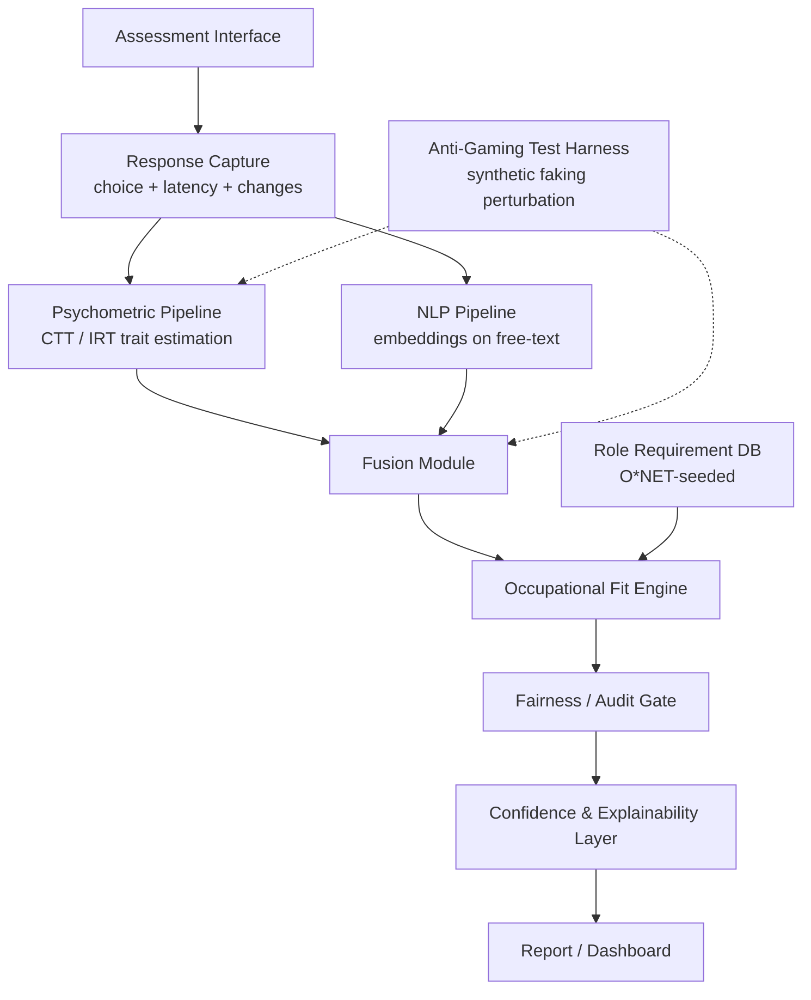
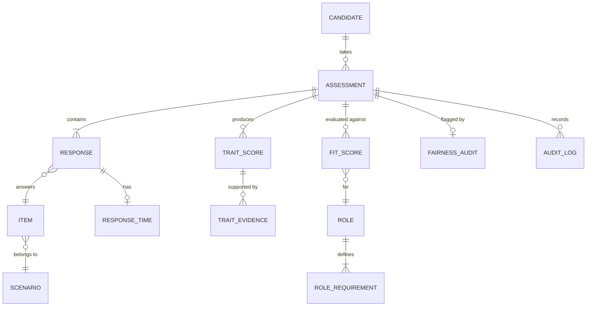

# Architecture & Planning — PsychoNet Node A

Companion to PRD v1.0. Covers system architecture, data model, stack, and build sequencing.

---

## 1. System overview

The dotted lines (K) indicate the anti-gaming harness is a **test-time/offline component** used to generate ablation numbers, not a live production path in v1 — per PRD FR5.

---

## 2. Component breakdown

### 2.1 Assessment pipeline
Delivers SJT items, captures response + latency + answer-change events. Domain variant (corporate/military) fixed at session configuration, not switchable mid-session (avoids introducing a confound into the response data).

### 2.2 Psychometric pipeline
- v1: Classical Test Theory scoring (sum/weighted-sum per facet) — simplest to validate first.
- v1.5: IRT-based scoring once item bank has enough calibration data (needs pilot N large enough for stable item parameters — do not attempt IRT calibration on toy sample sizes).

### 2.3 NLP pipeline
Sentence-embedding extraction (e.g., sentence-transformers) on any free-text justification fields, feeding a supplementary feature block into the fusion module — mirrors the Random-Forest-on-embeddings approach validated in prior literature (see Research Package v1, Section 12).

### 2.4 Fusion module
Combines psychometric trait estimates + NLP features + response-latency/consistency features into the Model 7 configuration. Must be implemented so each input block can be individually disabled — this is what makes the ablation study (Models 1–7) actually runnable from one codebase rather than seven separate builds.

### 2.5 Occupational fit engine
- Role profiles stored as structured trait-requirement vectors, seeded from O*NET, refined per Section 10 of the original brief (expert ratings / job analysis where O*NET granularity is insufficient).
- Fit score computed as a distance/similarity metric between candidate trait vector (with uncertainty) and role requirement vector — must propagate trait-level uncertainty into fit-score uncertainty, not just report a discrete similarity number.

### 2.6 Fairness/audit gate
Standalone module (see PRD FR6) — takes candidate demographic metadata (where available/consented) + fit scores, outputs subgroup performance breakdown. Kept architecturally separate so it can be extracted and described independently for the patent provisional filing.

### 2.7 Confidence & explainability layer
Traces every fit score back to contributing trait evidence and flags any role-relevant trait the assessment measured with low reliability. This is the layer that prevents the system from ever presenting a number without a "why."

### 2.8 Anti-gaming test harness
Offline tool: applies the calibrated synthetic fake-good perturbation to input responses, re-runs the pipeline, and logs the score shift (direction-corrected effect size, matching the formula structure from the LLM-SDR study in Research Package v1 §12). Used to generate the faking-robustness ablation numbers — not deployed against real user sessions in v1.

---

## 3. Data model (core entities)

Key fields worth calling out:
- `RESPONSE_TIME`: latency in ms, answer-change count — this is what feeds Model 4/5.
- `TRAIT_SCORE`: point estimate + standard error, model-config tag (which of Models 1–7 produced it) — critical for the ablation study to be queryable later, don't skip the model-config tag.
- `ROLE_REQUIREMENT`: trait, target level, source (O*NET / expert-derived / literature-derived) — tagging the source matters for defensibility in the paper.
- `FAIRNESS_AUDIT`: subgroup, metric, value, threshold, pass/fail — structured so it can be exported directly into the paper's fairness section.

---

## 4. Implementation stack

| Layer | Choice | Note |
|---|---|---|
| Frontend | React / Next.js | Assessment delivery UI, dashboard |
| Backend | FastAPI (Python) | Keeps ML and API in one language, simplifies the psychometric/NLP pipeline integration |
| Database | PostgreSQL | Relational fit for the entity model above |
| ML/psychometrics | scikit-learn, PyTorch, Python IRT libraries (e.g., `girth` or `mirt`-equivalent) | Start with scikit-learn baselines before deep learning — v1 does not need transformer-scale models for structured trait scoring |
| NLP | Sentence Transformers | Matches the validated embeddings+RF approach from the literature |
| Experiment tracking | MLflow | Every ablation run logged — required for reproducibility (PRD §6) |
| Visualization | Plotly | Dashboard charts for trait profiles and fit breakdowns |

---

## 5. Build sequence (maps directly to PRD Section 8 phases)

1. **P0**: Item bank + rater validation (no code yet — data/content work).
2. **P1**: Minimal FastAPI backend + Postgres schema (Section 3) + CTT scoring for Models 1, 4, 6 against public datasets. No frontend needed yet — CLI/notebook-driven is fine for pure ablation number generation.
3. **P2**: Occupational fit engine + O*NET-seeded role DB. Still backend-only is acceptable at this stage.
4. **P3**: Forced-choice + latency capture requires the actual assessment-delivery frontend to exist (can't get real latency data from a notebook) — this is where the React frontend becomes necessary, not before.
5. **P4**: Fairness/audit module — backend-only, can be built in parallel with P3's frontend work since it consumes already-produced fit scores.
6. **P5 (future)**: Adaptive/CAT logic, defence GTO-equivalent extensions, founder/sports domains — explicitly deferred.

**Practical sequencing note**: P1 and P2 can start immediately and don't require the item bank to be finished, since they run against Open-Psychometrics/PANDORA/essay data only. P3 is the actual bottleneck on item-bank validation — don't let P3 block P1/P2 from starting.

---

## 6. Security/privacy notes

- Consent screen before any assessment session begins, stating data use scope explicitly (research + demo, not commercial resale) — required before any pilot data collection, not just a nice-to-have.
- No demographic field is mandatory for taking the assessment — it's needed for the fairness audit, but making it required would itself introduce a consent/coercion problem in a small-N academic pilot.
- Audit log (immutable, append-only) for every assessment run, matching the AUDIT_LOG entity above — this also happens to be good practice for eventual patent documentation of the fairness-gate mechanism's actual behavior over time.
