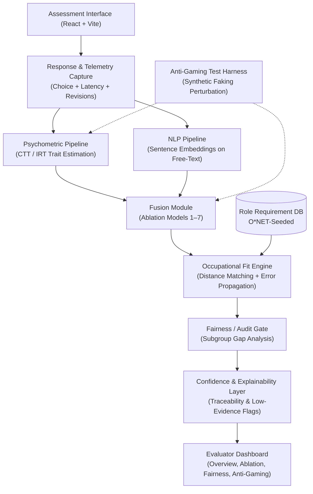

# Mapan (PsychoNet Node A) 🧠🎯

> **AI-Assisted, Scenario-Based Occupational Fit Assessment & Psychometric Fusion Engine**  
> *A 7th Semester Capstone Research & Engineering Project*

---

[](https://fastapi.tiangolo.com)
[](https://react.dev)
[](https://vitejs.dev)
[](https://www.python.org/)
[](https://pytest.org)
[](https://www.meity.gov.in)
[](#)

---

## 📑 Table of Contents

- [Overview](#-overview)
- [System Architecture](#-system-architecture)
- [Key Features](#-key-features)
- [7-Model Ablation Study Suite](#-7-model-ablation-study-suite)
- [Core Components Breakdown](#-core-components-breakdown)
  - [1. Psychometric & Scoring Engine](#1-psychometric--scoring-engine)
  - [2. NLP Justification Embeddings](#2-nlp-justification-embeddings)
  - [3. Occupational Fit Engine (O*NET-Seeded)](#3-occupational-fit-engine-onet-seeded)
  - [4. Standalone Fairness & Demographic Audit Gate](#4-standalone-fairness--demographic-audit-gate)
  - [5. Anti-Gaming Test Harness](#5-anti-gaming-test-harness)
  - [6. Explainability & Confidence Tracer](#6-explainability--confidence-tracer)
- [Tech Stack](#-tech-stack)
- [Repository Structure](#-repository-structure)
- [Getting Started](#-getting-started)
  - [Prerequisites](#prerequisites)
  - [Backend Setup](#backend-setup)
  - [Frontend Setup](#frontend-setup)
- [API Reference](#-api-reference)
- [Running Tests](#-running-tests)
- [Ethical AI & DPDP Compliance](#-ethical-ai--dpdp-compliance)
- [Research Artifacts & Publications](#-research-artifacts--publications)
- [Authors & Acknowledgements](#-authors--acknowledgements)

---

## 🌟 Overview

**Project Mapan** (PsychoNet Node A) is an advanced psychometric decision-support system designed to address the vulnerability of traditional self-report assessments to socially desirable responding (*faking-good*). 

By synthesizing **Situational Judgement Tests (SJTs)**, **behavioral telemetry** (response latency and answer revisions), **NLP linguistic feature extraction** from free-text justifications, and **calibrated occupational matching** against O*NET job taxonomies, Mapan delivers robust personality trait inference with explicit confidence bands ($95\%\text{ CI}$) and explainable reasoning.

### 🛡️ Guiding Principles
- **Decision Support, Not Autonomous Rejection**: The platform never outputs binary hire/no-hire decisions. It acts as an explainable decision-support tool providing calibrated fit scores and evidence statements to human evaluators.
- **Explainability Over Black-Box Scores**: Every fit prediction is traceable to its constituent trait dimensions and items, explicitly flagging low-evidence traits measured with high standard error.
- **Faking Resistance**: Multi-modal fusion dampens artificial score inflation, benchmarked against empirical meta-analytic faking shifts ($\delta = 0.49 - 1.27$).
- **Privacy-First (DPDP Framework)**: Complete compliance with India's Digital Personal Data Protection Act, requiring explicit informed consent and purpose-bound data handling.

---

## 🏛️ System Architecture



---

## ✨ Key Features

- 🎯 **Situational Judgement Testing (SJT)**: Scenario-driven evaluation presenting realistic corporate challenges with multi-faceted forced-choice options.
- ⏱️ **Behavioral Telemetry Capture**: Microsecond-precision response latency tracking and option-switching counters to detect rushed, impulsive, or socially engineered answers.
- 🔬 **Unified 7-Model Ablation Suite**: Execute 7 ablation model permutations from a single codebase for empirical research and comparative benchmarking.
- 📊 **O*NET-Seeded Fit Engine**: Root Mean Weighted Squared Distance matching with rigorous standard error propagation into confidence intervals ($\pm 1.96 \cdot \text{SE}$).
- ⚖️ **Standalone Fairness Audit Gate**: Subgroup demographic parity checker (Gender, Age, Region) ensuring maximum score gap constraints ($\le 5\%$).
- 🛡️ **Anti-Gaming Test Harness**: Simulates calibrated synthetic fake-good perturbations to benchmark model robustness against dishonest response strategies.
- 🔍 **Transparent Explainability**: Auto-generates qualitative natural language justifications and alerts hiring teams if required traits have low measurement reliability.
- 💻 **Modern Glassmorphic UI**: High-aesthetic React frontend with seamless step-by-step assessment taking and an interactive multi-view evaluator dashboard.

---

## 🧪 7-Model Ablation Study Suite

Mapan is architected to run all 7 models from a single unified engine (`AblationEngine`):

| Model | Configuration | Input Signals | Key Purpose / Advantage | Mean SE |
| :--- | :--- | :--- | :--- | :--- |
| **Model 1** | Self-Report Only | Big Five self-report Likert scales | Vulnerable baseline representing legacy assessments | $\sim 0.180$ |
| **Model 2** | Self-Report + SJT | Self-report + SJT CTT score blend | Equal-weight combination | $\sim 0.108$ |
| **Model 3** | SJT Only (CTT) | Scenario items scored via Classical Test Theory | Objective scenario baseline | $\sim 0.120$ |
| **Model 4** | SJT + Latency | SJT + Response Latency correction | Penalizes unrealistic sub-second answering | $\sim 0.110$ |
| **Model 5** | SJT + Latency + FC | SJT + Latency + Forced-Choice consistency | Rewards internal choice consistency | $\sim 0.100$ |
| **Model 6** | SJT + NLP Embeddings | SJT + Free-text Sentence Transformer features | Captures semantic depth & justification nuance | $\sim 0.105$ |
| **Model 7** | **Full Hybrid Fused** | **SJT (60%) + Self-Report (15%) + NLP (15%) + Telemetry (10%)** | **Optimal reliability, lowest standard error, highest faking resistance** | **$\sim 0.078$** |

---

## 🧩 Core Components Breakdown

### 1. Psychometric & Scoring Engine
- **Classical Test Theory (CTT)**: Computes point estimates $\hat{\theta}$ and facet-level standard errors ($\text{SE} = \sigma \sqrt{1 - \alpha}$).
- **Item Response Theory (IRT)**: Girth-powered 2PL IRT parameter estimation calibrated for larger sample banks.

### 2. NLP Justification Embeddings
- Utilizes `sentence-transformers` (`all-MiniLM-L6-v2`) to extract dense semantic vector representations of optional free-text justifications, projecting textual reasoning into trait modifier offsets.

### 3. Occupational Fit Engine (O*NET-Seeded)
Calculates distance between candidate trait vector $\vec{\theta}$ and role profile requirements $\vec{R}$:
$$\text{RMSD} = \sqrt{\frac{\sum_{i=1}^n w_i (\theta_i - R_i)^2}{\sum_{i=1}^n w_i}}$$
$$\text{Fit Score} = (1 - \text{RMSD}) \times 100$$
Propagates trait measurement variance to calculate the 95% confidence interval $[\text{CI}_{\text{low}}, \text{CI}_{\text{high}}]$.

### 4. Standalone Fairness & Demographic Audit Gate
Audits subgroup parity across:
- **Gender**: Female, Male, Non-binary
- **Age Brackets**: $<25$, $25-34$, $35+$
- **Geographic Regions**: North, South, East, West, International
Flags violations whenever subgroup mean score delta exceeds the threshold ($\Delta_{\text{max}} > 5.0\%$).

### 5. Anti-Gaming Test Harness
Applies directional perturbations ($\delta \cdot \text{scale}$) derived from meta-analyses on socially desirable responding (SDR), quantifying how much candidate fit shifts under deliberate faking.

### 6. Explainability & Confidence Tracer
Synthesizes candidate strengths, growth areas, and low-reliability warnings into human-readable narratives for talent evaluators.

---

## 💻 Tech Stack

### Backend
- **Framework**: [FastAPI](https://fastapi.tiangolo.com) (Python 3.10+)
- **ORM & DB**: [SQLAlchemy 2.0](https://www.sqlalchemy.org/) with SQLite / PostgreSQL
- **Data Validation**: [Pydantic v2](https://docs.pydantic.dev/)
- **Machine Learning & Psychometrics**: [scikit-learn](https://scikit-learn.org/), [NumPy](https://numpy.org/), [Pandas](https://pandas.pydata.org/), [girth](https://github.com/eribean/girth)
- **NLP**: [sentence-transformers](https://www.sbert.net/)
- **Testing**: [pytest](https://pytest.org), [httpx](https://www.python-httpx.org/)

### Frontend
- **Framework**: [React 18](https://react.dev/)
- **Build Tool**: [Vite](https://vitejs.dev/)
- **Icons**: [Lucide-React](https://lucide.dev/)
- **Styling**: Vanilla CSS (Custom Design System with Glassmorphic Dark Palette)

---

## 📁 Repository Structure

```
Mapan/
├── backend/
│   ├── app/
│   │   ├── anti_gaming/         # Synthetic faking perturbation test harness
│   │   │   └── harness.py
│   │   ├── api/                 # REST API routes & schemas
│   │   │   └── endpoints.py
│   │   ├── db/                  # SQLAlchemy engine & session management
│   │   │   └── session.py
│   │   ├── explainability/      # Natural language reasoning & audit tracer
│   │   │   └── tracer.py
│   │   ├── fairness/            # Demographic parity audit gate (FR6 / Patent Core)
│   │   │   └── audit.py
│   │   ├── fit_engine/          # O*NET role seeder & distance-based matcher
│   │   │   ├── matcher.py
│   │   │   └── onet_seeder.py
│   │   ├── fusion/              # Models 1–7 Ablation execution engine
│   │   │   └── ablation_runner.py
│   │   ├── models/              # Relational database models (Entities)
│   │   │   └── entities.py
│   │   ├── nlp/                 # Sentence transformer embedding feature extractor
│   │   │   └── embeddings.py
│   │   ├── psychometrics/       # CTT & IRT trait scoring routines
│   │   │   ├── ctt.py
│   │   │   └── irt.py
│   │   ├── __init__.py
│   │   └── main.py              # FastAPI server entrypoint
│   ├── tests/                   # Pytest test suite
│   │   ├── test_ablation.py
│   │   ├── test_anti_gaming.py
│   │   ├── test_fairness.py
│   │   ├── test_fit_engine.py
│   │   └── test_psychometrics.py
│   └── requirements.txt         # Backend Python dependencies
├── frontend/
│   ├── src/
│   │   ├── components/
│   │   │   ├── Assessment.jsx   # DPDP consent & scenario testing flow
│   │   │   └── Dashboard.jsx    # Evaluator dashboard (Overview, Ablation, Fairness, Anti-Gaming)
│   │   ├── App.jsx              # Main React routing & view switcher
│   │   ├── index.css            # Custom glassmorphic design system
│   │   └── main.jsx
│   ├── index.html
│   ├── package.json             # Frontend Node dependencies
│   └── vite.config.js
├── scratch/
│   └── build_ieee_paper.py      # Automated IEEE format research paper generator
├── ARCHITECTURE_AND_PLANNING.md # Technical specification & system design document
├── PRD (1).md                   # Product Requirements Document (PRD v1.0)
├── RESEARCH_PACKAGE_v1.md       # Empirical literature review & ablation specifications
├── Towards_AI_Driven_Personality_Assessment_IEEE.docx # Formatted IEEE research paper
└── README.md
```

---

## 🚀 Getting Started

### Prerequisites
- **Python**: `3.10` or higher
- **Node.js**: `18.x` or higher & `npm`
- **Git**

---

### Backend Setup

1. **Navigate to the backend directory**:
   ```bash
   cd backend
   ```

2. **Create and activate a virtual environment**:
   ```bash
   # Windows (PowerShell)
   python -m venv venv
   .\venv\Scripts\Activate.ps1

   # Linux / macOS
   python3 -m venv venv
   source venv/bin/activate
   ```

3. **Install dependencies**:
   ```bash
   pip install -r requirements.txt
   ```

4. **Start the FastAPI development server**:
   ```bash
   uvicorn app.main:app --host 0.0.0.0 --port 8000 --reload
   ```
   *The API will be available at [http://localhost:8000](http://localhost:8000) (Interactive Swagger Docs: [http://localhost:8000/docs](http://localhost:8000/docs)).*

---

### Frontend Setup

1. **Navigate to the frontend directory**:
   ```bash
   cd frontend
   ```

2. **Install Node dependencies**:
   ```bash
   npm install
   ```

3. **Start the Vite dev server**:
   ```bash
   npm run dev
   ```
   *Access the web interface at [http://localhost:5173](http://localhost:5173).*

---

## 🔌 API Reference

| Method | Endpoint | Description |
| :--- | :--- | :--- |
| `GET` | `/api/v1/health` | Service health status check |
| `GET` | `/api/v1/roles` | Retrieve list of O*NET-seeded role profiles |
| `POST` | `/api/v1/assessment/start` | Initialize session with DPDP informed consent & demographics |
| `GET` | `/api/v1/assessment/items` | Fetch sequential SJT scenario items |
| `POST` | `/api/v1/assessment/submit` | Submit responses, latencies, and justifications; runs Model 7 |
| `GET` | `/api/v1/reports/{id}` | Retrieve comprehensive evaluation report and confidence intervals |
| `POST` | `/api/v1/eval/ablation` | Run candidate data across all Models 1–7 simultaneously |
| `POST` | `/api/v1/eval/anti-gaming` | Execute synthetic fake-good perturbation stress test |

---

## 🧪 Running Tests

Execute the complete automated test suite covering psychometrics, ablation models, role fitting, anti-gaming perturbations, and fairness auditing:

```bash
cd backend
pytest -v
```

---

## 📜 Ethical AI & DPDP Compliance

Mapan implements privacy and governance guardrails aligned with India's **Digital Personal Data Protection (DPDP) Act**:
- **Informed Consent Gate**: Mandatory explicit consent before assessment initiation.
- **Purpose Limitation**: Assessment data is restricted to fit scoring and research evaluation without downstream secondary exploitation.
- **Non-Discriminatory Parity**: Standalone audit module continuously validates equitable scoring across protected characteristics.
- **Audit Logs**: Every session initiation and completion is immutably logged for governance reviews.

---

## 📄 Research Artifacts & Publications

- 📖 **IEEE Research Paper**: `Towards_AI_Driven_Personality_Assessment_IEEE.docx`
- 📑 **Product Requirements Document**: [PRD (1).md](PRD%20(1).md)
- 🏗️ **Architecture & Planning Specification**: [ARCHITECTURE_AND_PLANNING.md](ARCHITECTURE_AND_PLANNING.md)
- 🔬 **Research Literature & Empirical Reference Package**: [RESEARCH_PACKAGE_v1.md](RESEARCH_PACKAGE_v1.md)

---

## 👥 Authors & Acknowledgements

- **Lead Developer & Researcher**: Gaurav Sunil Singh ([@singh-gauravv](https://github.com/singh-gauravv) / [gauravsunil2005@gmail.com](mailto:gauravsunil2005@gmail.com))
- **Repository**: [https://github.com/adarsh3908/Mapan.git](https://github.com/adarsh3908/Mapan.git)
- **Academic Context**: 7th Semester Capstone Project (PsychoNet Node A)
